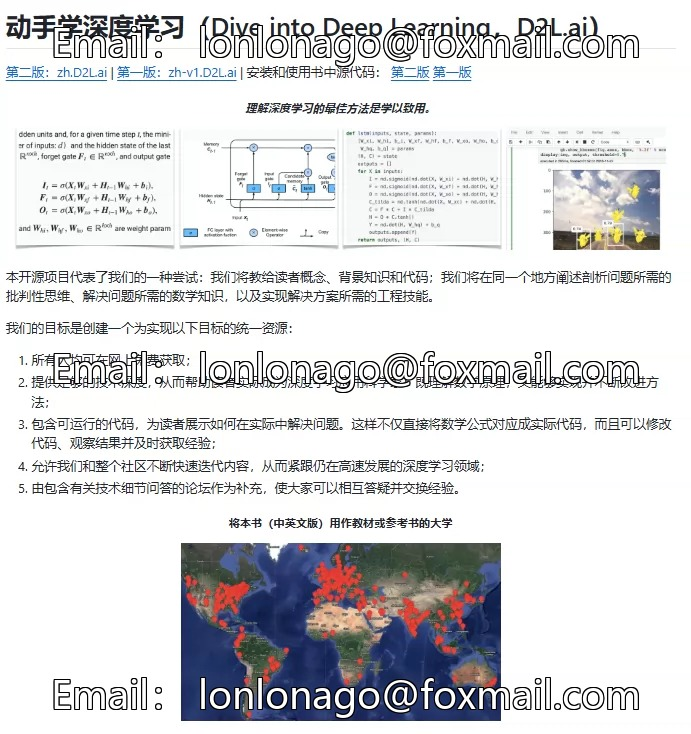
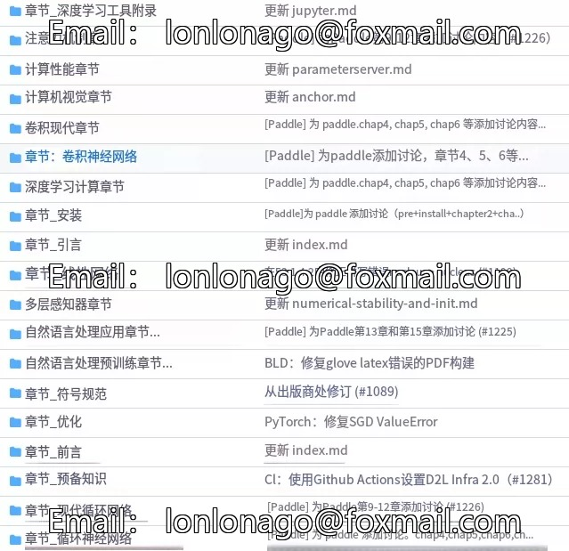
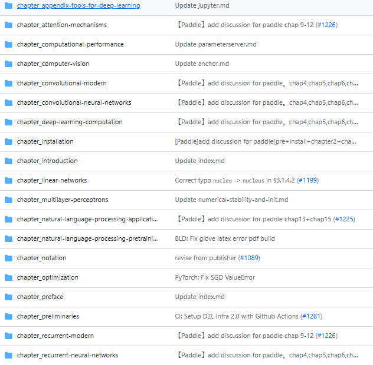

## Body

GitHub High-Star Project Share | "Learn Deep Learning by Doing"

"Learn Deep Learning by Doing" is an official classic textbook from D2L, led by Li Mu. It combines theory with code practice. The entire book can be run in Jupyter, covering core topics such as CNN, RNN, and attention mechanisms. It is adaptable to multiple frameworks, essential for beginners learning from scratch, university teaching, and the advanced skills of AI engineers.

This book breaks away from the traditional learning dilemma of "prioritizing theory over practice," with each section being a Jupyter notebook that can be directly executed. It integrates text explanations, mathematical formulas, diagrams, complete codes, and running results, allowing readers to learn and practice simultaneously, quickly developing deep learning capabilities.

Core Content:
--------Basic Introduction: Preparatory knowledge for deep learning, linear networks, multilayer perceptrons, solidifying mathematics and programming foundations.
--------Core Models: Convolutional neural networks, recurrent neural networks, attention mechanisms, modern pre-training techniques, covering the principles and implementation of mainstream algorithms.
--------Engineering Practice: Model computation, optimization algorithms, performance tuning, distributed training, solving real-world engineering problems.
--------Application Deployment: Practical cases in fields like computer vision and natural language processing, bridging from principles to applications.

Electronic Virtual Products Sold Without Refund

Note: This electronic product is sold without returns or exchanges.

## Images

item_1048550582717

Here is a pay link on Stripe ( https://buy.stripe.com/3cs8yP7sY87d0vu9AB ). Please contact me lonlonago@foxmail.com after funding $89, and I will send you a complete data files , thank you!

